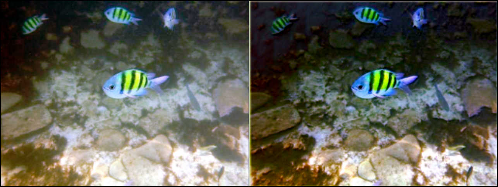
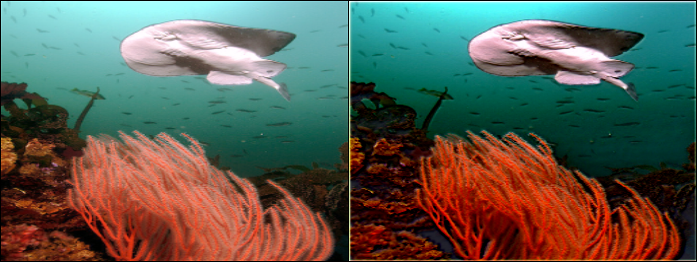
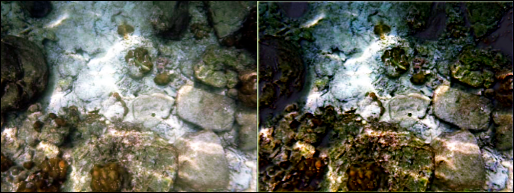

# AOD-Net PyTorch (Modified)

This repo is based on the original [AOD-Net-PyTorch by walsvid](https://github.com/walsvid/AOD-Net-PyTorch).  
I modified the code to match the dataset I used for training, and included compatibility updates for training and testing on Google Colab.

You can find the pretrained models under the [`models/`](./models) directory.

## Sample Results

Here are some dehazed examples from the model:

    
    
   

